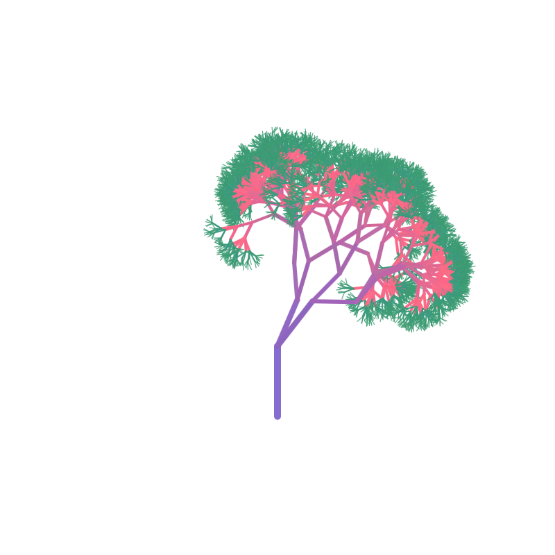

---

# Cute Tree

### Author: Stefan Nicov

# Introduction

The CuteTree project emerged as both a desire to apply the accumulated knowledge in OOP and ML but also as an attempt to come up with an idea for research. The main idea is to study what aspects and features of an object humans interpret as "beautiful". We will restrict ourselves to images of digitally generated trees. Our prior knowledge and intuition suggests that a symmetrical structure and a "pleasant" color palette are some of the features that signals the "beautifulness" of a tree image. However, we expect the trained Neural Network to be able to recognize other patterns that we, humans, interpret as "beautiful". We plan to extract the features that the NN recognizes by visualizing the activation atlas of the trained model.

The project consists of 3 main parts:

1.  Tree Generation

2.  Model Training

3.  Model Analysis

# Tree Generation

We are working in p5.js, an opensource JavaScript library created specifically for generative art. Here we are gonna draw a tree and save it as a .png file. It is possible either to run in in an online IDE and compiler [here](link) or on a localhost server. We will implement the second approach.

We would structure a tree consisting of layers, each layer consisting of branches. The first layer is the trunk. From that layer, a new one is built buy constructing new branches from the end of every of the previous layer's branches. While this suggests a simple recursive algorithms, we would like to implement an Object Oriented approach, where every tree is an instance of a Tree object.

Inspired by the Genetic Algorithms approach, every tree would be described by a set of "genes" that represents the features of the tree. In our case, the "genes" will be a matrix of values, where every row is a feature of the tree and every column corresponds to a layer of the tree.

The list of the features and what they mean is the following:

-   Length: the length of every branch

-   Length deviation: how much can the length deviate from it's value in absolute terms

-   Size: the thickness of the branches

-   R: the Red value of the RGB color representation of the branches

-   G: the Green value of the RGB color representation of the branches

-   B: the Blue value of the RGB color representation of the branches

-   R Change: how much the R feature can vary in absolute terms

-   G Change: how much the G feature can vary in absolute terms

-   B Change: how much the B feature can vary in absolute terms

-   Branches: how many branches will grow from the end of this branch

-   Angle deviation: by how much can the angle of the branch deviate from the previous branch, in absolute terms

------------------------------------------------------------------------

Below you can find a sample of a matrix and the corresponding image of the tree.

| Feature          | Layer 1 | Layer 2 | Layer 3 | Layer 4 | Layer 5 | Layer 6 | Layer 7 | Layer 8 | Layer 9 | Layer 10 |
|-------|-------|-------|-------|-------|-------|-------|-------|-------|-------|-------|
| Length           | 50      | 40      | 30      | 25      | 20      | 15      | 12      | 10      | 7       | 5        |
| Length deviation | 5       | 5       | 4       | 3       | 3       | 3       | 2       | 2       | 2       | 1        |
| Size             | 5       | 4       | 3       | 3       | 3       | 2       | 2       | 2       | 1       | 0.5      |
| R                | 125     | 135     | 155     | 165     | 185     | 205     | 225     | 245     | 55      | 55       |
| G                | 100     | 100     | 100     | 100     | 100     | 100     | 100     | 100     | 150     | 150      |
| B                | 200     | 190     | 180     | 170     | 160     | 150     | 140     | 130     | 120     | 110      |
| R Change         | 10      | 10      | 10      | 10      | 10      | 10      | 10      | 10      | 10      | 10       |
| G Change         | 10      | 10      | 10      | 10      | 10      | 10      | 10      | 10      | 10      | 10       |
| B Change         | 10      | 10      | 10      | 10      | 10      | 10      | 10      | 10      | 10      | 10       |
| Branches         | 2       | 2       | 2       | 2       | 3       | 3       | 3       | 4       | 4       | 4        |
| Angle deviation  | 0       | 60      | 60      | 60      | 60      | 60      | 60      | 60      | 60      | 60       |



To implement this, we would create a Tree class, every individual tree will be an instance of a Tree object which takes as input a matrix. In our case, for simplification, we will represent our matrix as an array. The constructor of our Tree class looks like this:

``` javascript
constructor(a, layer, x, y, angle) { 

  this.a = a; //this is the array that contains all the information 
  this.layer = layer; //the layer number 
  this.x = x; //the X position on canvas where we start to draw our tree
  this.y = y; //the Y position on canvas where we start to draw our tree 
  this.angle = angle;

       
  //here we extract the parameters defined above from our array
  this.length = a[layer];
  this.length_deviation = a[10 + layer];
  this.size = a[20 + layer];
  this.red = a[30 + layer];
  this.green = a[40 + layer];
  this.blue = a[50 + layer];
  this.red_change = a[60 + layer];
  this.green_change = a[70 + layer];
  this.blue_change = a[80 + layer];
  this.branches = a[90 + layer];
  this.angle_deviation = a[100 + layer]


}
```

Now we would need a function that actually draws our Tree object

``` javascript
show() {
        strokeWeight(this.size); //setting the size
        let col = color(
            this.red + random(this.red_change),
            this.green + random(this.green_change),
            this.blue + random(this.blue_change)
        ); //obtaining the color variable from RGB values
        
        stroke(col); //setting the color

        let deviated_angle = this.angle + random(-this.angle_deviation, this.angle_deviation); //calculating the angle
        let endX = this.x + (this.length + random(-this.length_deviation, this.length_deviation)) * sin(radians(deviated_angle)); 
        //calculate the branch end point X coordinate
        let endY = this.y - (this.length + random(-this.length_deviation, this.length_deviation)) * cos(radians(deviated_angle)); 
        //calculate the branch end point Y coordinate
        line(this.x, this.y, endX, endY); //draw a branch

        // Produce offspring agents
        if (this.layer < 9) { // Only produce offspring if not on the last layer
            for (let i = 0; i < this.branches; i++) {
                let offspring = new Tree(this.a, this.layer + 1, endX, endY, deviated_angle);
                offspring.show();
            }
        }
    }
```

Now that we have a Tree object with a show() function, let's create an image and download it.

``` javascript
let test_array = [
        50, 40, 30, 25, 20, 15, 12, 10, 7, 5, //length
        5, 5, 4, 3, 3, 3, 2, 2, 2, 1, // length deviation
        5 , 4 , 3 , 3 , 3 , 2 , 2 , 2 , 1, 0.5, // size
        125, 135, 155, 165, 185, 205, 225, 245, 55, 55, // red
        100, 100, 100, 100, 100, 100, 100, 100, 150, 150, // green
        200, 190, 180, 170, 160, 150, 140, 130, 120, 110, // blue
        10, 10, 10, 10, 10, 10, 10, 10, 10, 10, // red change
        10, 10, 10, 10, 10, 10, 10, 10, 10, 10, // green change
        10, 10, 10, 10, 10, 10, 10, 10, 10, 10, // blue change
        2, 2, 2, 2 , 3, 3, 3, 4, 4, 4, // number of branches
        0, 0, 0, 15, 15, 25, 25, 35, 35, 35, // angle
        0, 60, 60, 60, 60, 60, 60, 60, 60, 60 // angle deviation
    ];

function setup() {
    createCanvas(400, 400);

    test = new Tree(test_array, 0, 200, 300, 0);
    test.show();
    save(`agent_test.png`);

}

function draw() {
    noLoop();
}
```

This code creates exactly the picture of the tree above. Now, to obtain training data, we would need a large dataset of tree images. This means that we would need a different array of values for every tree, therefore it is convenient to create a function that returns a random array. While the values inside the array should be random, keep in mind that the values should both be in a certain range (for example 0 to 255 for color variables). By testing and trying all over again, I think the below range of values are optimal to ensure a diverse tree generation.

``` javascript
function createArray() {
    let the_array = [
        50 + random(50), 40 + random(40), 30 + random(30), 25 + random(25), 20 + random(20), 15 + random(15), 12 + random(12),
        10 + random(10), 7 + random(7), 5 + random(5), //length
        random(5), random(5), random(5), random(3), random(3), random(3), random(2), random(2), random(2), random(1), // length deviation
        5 + random(2), 4 + random(2), 3 + random(2), 3 + random(2), 3 + random(2), 2 + random(1), 2 + random(1),
         2 + random(1), 1 + random(1), random(1), // size
        255 * random(1), 255 * random(1), 255 * random(1), 255 * random(1), 255 * random(1), 255 * random(1),
         255 * random(1), 255 * random(1), 255 * random(1), 255 * random(1), // red
        255 * random(1), 255 * random(1), 255 * random(1), 255 * random(1), 255 * random(1), 255 * random(1),
         255 * random(1), 255 * random(1), 255 * random(1), 255 * random(1), // green
        255 * random(1), 255 * random(1), 255 * random(1), 255 * random(1), 255 * random(1), 255 * random(1),
         255 * random(1), 255 * random(1), 255 * random(1), 255 * random(1), // blue
        10 * random(1), 10 * random(1), 10 * random(1), 10 * random(1), 10 * random(1), 10 * random(1), 10 * random(1),
         10 * random(1), 10 * random(1), 10 * random(1), // red change
        10 * random(1), 10 * random(1), 10 * random(1), 10 * random(1), 10 * random(1), 10 * random(1), 10 * random(1),
         10 * random(1), 10 * random(1), 10 * random(1), // green change
        10 * random(1), 10 * random(1), 10 * random(1), 10 * random(1), 10 * random(1), 10 * random(1), 10 * random(1),
         10 * random(1), 10 * random(1), 10 * random(1), // blue change
        2 + random(2), 2 + random(2), 2 + random(2), 2 , 4, 4, 4, 4, 4, 4, // number of branches
        0, random(120), random(120), random(120), random(120), random(120), random(120), random(120), random(120),
         random(120) // angle deviation
    ];

    return the_array;
}
```

Now, in the setup() function, we need to create all these objects and store them in our array. Let's begin with 1000 trees.

``` javascript
function setup() {
    createCanvas(800, 800);

    for (let i = 0; i < 1000; i++) {
        let array = createArray();
        trees.push(new Tree(array, 0, 400, 600, 0));
    }
}
```

Now we need to show every tree from the array and save a picture of it. Let's create a function for this!

``` javascript
function saveNextAgent() {
    if (saveIndex < trees.length) {
        background(255); // Clear the canvas for each new agent
        trees[saveIndex].show();
        save(`agent_${saveIndex}.png`);
        saveIndex++;
        setTimeout(saveNextAgent, 500); // Delay before saving the next agent
    }
}
```

As you can observe, here we use a saveIndex variable that should be declared and initialized to 0 in the beginning of our sketch.js document. For an optimal training, we would need around 5-10 thousand images of our trees, with a nearly even split between "beautiful" and "non-beautiful" trees.

After generation, we asked a group of 10 people, primarily our friends, to label the trees into "beautiful" and "non-beautiful" groups at their own subjective opinion, thus obtaining a dataset suitable for training.

# Model Training

Historically, the AlexNet convolutional neural network marked a new milestone in image classification. For our project, we will use a modified version of AlexNet with binary classification

### WORK IN PROGRESS - WILL BE CONTINUED
