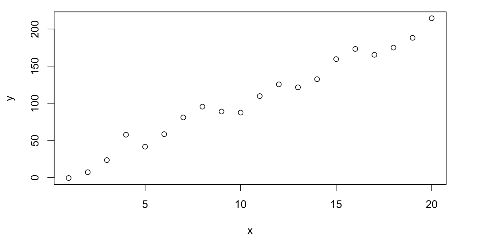

In 7th grade physics class we were trying to weight the Earth with a stopwatch and a string. This is how I first met linear regression...

Since always people had the tendency to try and predict stuff. Hypothetically, people could observe the number of sunny days during summer and predict, guess, estimate the crop yield in the harvest period. Essentially, they were doing regression. What is regression? By [Wiki](https://en.wikipedia.org/wiki/Regression_analysis):

> regression analysis is a set of statistical processes for estimating the relationships between a dependent variable (often called the 'outcome' or 'response' variable, or a 'label' in machine learning parlance) and one or more independent variables (often called 'predictors', 'covariates', 'explanatory variables' or 'features').

Now, the most popular instant in which people use linear regression is when fitting a line in a plot of two variables of interest:

To translate the linearity between $Y$ and $X$ into math language, we usually write $Y \sim X$.

But how to fit the line? From the infinity of lines you could fit, which one is the **best** one?

A natural way to approach this question is to choose a line that is closest to all the points. Distance is a quantity we can measure, therefore we could translate this into math language.

Let's say we have $n$ pairs of data points $(X_i, Y_i)$ with $i \in {1, \dots, n}$. By our guess that there is a linear relationship between the variables, we could write $\tilde{Y}_i = \alpha + \beta X_i$. But we aware, $\tilde{Y}_i$ is just our guess of what $Y_i$ is based on the linear approximation of the dependence of the variables. $Y_i$ is still the true value, the observed data point, while $\tilde{Y}_i$ is our guess. Now, we want to find such $\alpha$ and $\beta$ so that our guess would as good as possible. For that, let's measure how much we deviated from the true value and call this value $\varepsilon_i = Y_i - \tilde{Y_i}$. These quantities are also called the residuals.

Now, the most popular approach to find $\alpha$ and $\beta$ is to minimize the sum of the squared residuals. That is, the method of least squares.

Our minimization quantity is then $S(\alpha, \beta) = \sum_{i = 1}^N \varepsilon_i^2$.

Therefore, by elementary calculus, we can form a system of equations:

$$\frac{\partial S}{\partial \alpha} = 0 \implies \sum_{i = 1}^n - 2 (Y_i - \alpha - \beta X_i) = 0$$ $$\frac{\partial S}{\partial \beta} = 0 \implies \sum_{i = 1}^n - 2 (Y_i - \alpha - \beta X_i) X_i = 0$$

Tu further simplify, let's introduce the notation $\overline{Z} = \frac{\sum_{i = 1}^n Z_i}{n}$ of the average value of a quantity.

Therefore, we can rewrite our equations as

$$\sum_{i = 1}^n Y_i = \alpha + \beta \sum_{i = 1}^n X_i$$ $$\sum_{i = 1}^n X_i Y_i = \alpha \sum_{i = 1}^n X_i + \sum_{i = 1}^n X_i^2$$

Which is equivalent to

$$\overline{Y} = \alpha + \beta \overline{X}$$ $$\overline{XY} = \alpha \overline{X} + \beta \overline{X^2}$$

Solving this system of equations we obtain the results:

$$\beta = \frac{\overline{XY} - \overline{X} \overline{Y}}{\overline{X^2} - \overline{X}^2}$$

$$\alpha = \overline{Y} - \beta \overline{X}$$

Now, for a worked out example, let's weight the Earth. We know that the period of a gravitational pendulum is related to it's length by the formula $T = 2 \pi \sqrt{\frac{l}{g}}$, where $T$ is the period, $l$ is the length, $g$ is the gravitational acceleration (which theoretically is $9.81 \frac{m}{s^2}$ at my position).

To obtain the experimental values, take a stopwatch, a string to which you should attach a small weight. Swing the string and measure the period of oscillations for different lengths. Collect the data in a table and perform a regression!

There are 3 details here that are worth to be discussed.

First of all, if we have a formula $T = 2 \pi \sqrt{\frac{l}{g}}$ why we would need to perform multiple measurements? Wouldn't it be enough to measure the period and the lengths once and then just compute what is $g$? Well, no. Our formula works perfectly in an idealized world, where there is no friction, the weight is point-like, the string is weightless, no humidity, perfect human reaction... a lot of factors are neglected in our experiment. To account for these factors, we introduce error term $\varepsilon_i$ that encapsulate all the things we neglected.

$$T_i = 2 \pi \sqrt{\frac{l_i}{g}} + \varepsilon_i$$

If we denote, as previously, $\tilde{T_i} = 2 \pi \sqrt{\frac{l_i}{g}}$ then we arrive at the same situation as discussed above.

Secondly, while the equations look similar, one could easily say that they are not linear at all! Indeed, our relationship implies that $T \sim \sqrt{l}$ which is not linear in length. However, the namelinear regression comes from the linearity in the coefficients, not in the variables. We can easily perform a change of variable: note $Y_i = T_i$ and $X_i = \sqrt{l_i}$ and $\beta = \frac{2 \pi}{\sqrt{g}}$. Now, we have our regression in the more familiar form:

$$Y_i = \beta X_i + \varepsilon_i$$

And now the last detail: the missing $\alpha$. We notice that our model has no intercept. There are two approaches here. Firstly, we could *force* the linear regression to have a zero intercept. Normally, this would imply that a non-zero intercept would be totally wrong for our model and is leading to impossible values/answers. A second approach would be to introduce the intercept, and maybe try to make sense of it later.

Let's take the later approach, by introducing our intercept

$$Y_i = \alpha + \beta X_i + \varepsilon_i$$

There is a pretty nice explanation why an intercept would make sense here: human reaction time. You see, whenever you click stop on the stopwatch, you are not doing it exactly at the right time. There is a small lag between seeing the image (end of a swing of the pendulum), processing the information in our brain, having a response, moving the finger to click on the stopwatch... it takes time, which is caled human reaction time, which is usually at the value of $0.2$ seconds.

Therefore, our measured value $T_i$ is the sum of the *actual* value $\tau_i$ and the human reaction time $\tau_0$. Hence, our intercept $\alpha$ would be exactly the human reaction time! Therefore, after collecting the data, you could not only weight the Earth, but also measure your own reaction time! Now, I did the experiment and collected the following data:

|       |      |      |      |      |      |      |      |      |      |      |
|-------|------|------|------|------|------|------|------|------|------|------|
| l (m) | 0.23 | 0.41 | 0.54 | 0.67 | 0.73 | 0.85 | 0.96 | 1.07 | 1.18 | 1.24 |
| T (s) | 1.19 | 1.45 | 1.64 | 1.61 | 1.90 | 2.06 | 2.02 | 2.17 | 2.28 | 2.38 |

Now let's transform our variables, $Y_i = T_i$ and $X_i = \sqrt{l_i}$

|     |      |      |      |      |      |      |      |      |      |      |
|-----|------|------|------|------|------|------|------|------|------|------|
| X   | 0.48 | 0.64 | 0.73 | 0.82 | 0.85 | 0.92 | 0.98 | 1.03 | 1.09 | 1.11 |
| Y   | 1.19 | 1.45 | 1.64 | 1.61 | 1.90 | 2.06 | 2.02 | 2.17 | 2.28 | 2.38 |

Now we can estimate $\alpha$ and $\beta$ to be $0.255$ and $1.865$ respectively. Note that $\alpha$ is pretty accurately in agreement with our prior knowledge of human reaction time! Moreover, $\beta = \frac{2 \pi}{\sqrt{g}}$ therefore $g = \frac{4 \pi^2}{\beta^2} = 11.34$

While the estimation of the human reaction time turned to be pretty decent, there is certainly something wrong with the obtained value of $g$ (therefore, there is something wrong with $\beta$).

To see if we could change something, we can instead transform the variables in a different way: $T = 2 \pi \sqrt{\frac{l}{g}} \implies \frac{g T^2}{4 pi^2} = l$, therefore we can change our variables to $Y_i = l_i$ and $X_i = T_i^2$, now with $\beta = \frac{g}{4 \pi^2}$.

Therefore $Y_i = \beta X_i + \varepsilon_i$

In this case, let's see both cases when we add an intercept and when we force it to be zero.

When we add an intercept, we obtain $\beta = 0.234$ and $\alpha = -0.06$ which leads to an estimation $g = 4 \pi^2 \beta = 9.23$ which is already better and close to the actual value. Now, what if we force the intercept to be zero? We obtain $\beta = 0.219$ and $g = 8.65$ which is worse off. As a rule of thumb, we should always be careful when forcing the zero intercept, and better check both cases if possible.

